# `combo_drg_yyy` 決策流程

DRG 候選產生(依病人屬性 + 診斷/手術碼篩出可能 DRG),對應 `_decompiled_rddt_lib\rddi_lib\rddi0001.cs` 第 1748–1919 行。
由 `rddi1000_main` 在外科/內科分流時多次呼叫(見 [`rddi1000_main_flow.md`](rddi1000_main_flow.md) 的 `C00` / `Surg` / `Med` 節點),產出候選陣列後交給 [`tree_yyy`](tree_yyy_flow.md) 決選。

核心是組一條巨大的 `DataView.RowFilter`(變數 `sql1300`)套在 `dt_RDDT_MDC_DRGWGT_DRG_XICD`(`RDDT_MDC_DRGWGT` × `RDDT_DRG_XICD` 合併視圖)上,再逐筆過濾收集。

```mermaid
flowchart TD
    Start(["combo_drg_yyy(mdcType)"]) --> OutDate["TEMP_OUT_DATE = H_OUT_DATE<br/>(空或 0000/00/00 → 當年/12/31)"]
    OutDate --> Regen["in_H_CM_CODE_Gen() 重建診斷碼集<br/>in_ICDOP_TAB_Gen() 重建手術碼集"]
    Regen --> BuildFilter["組 RowFilter (sql1300):以下子句全部 AND"]

    BuildFilter --> F1["① TREE_MDC_NO = v_MDC_1"]
    F1 --> F2["② CC 條件:<br/>(TREE_DRG=228 且 ITEM_TYPE=B)<br/>OR COMBO_NO ∈ {63,67,72}<br/>OR CC_MARK ∈ {X, H_CC_MARK_1}"]
    F2 --> F3["③ 年齡條件:AGE_MARK=N<br/>OR (AGE_MARK=Y 且符合門檻旗標)<br/>18Y/36Y/41Y/5Y_65Y/2Y(歲)<br/>28D/2D(天,新生兒)"]
    F3 --> F4["④ 存活/轉歸條件 (LIVE_MARK × H_TRAN_CODE):<br/>LIVE_MARK=N 須死亡(tran=4)或 12701+轉A<br/>LIVE_MARK=Y 須非死亡且非 12702+轉A<br/>LIVE_MARK 為 null 一律通過"]
    F4 --> F5{"v_MDC_1 = 15 ?"}
    F5 -- 是 (新生兒) --> Skip5["不加 DEP 條件"]
    F5 -- 否 --> F5b{"v_MDC_1 = 22 ?"}
    F5b -- 是 --> Dep22["⑤ COMBO_NO ∈ {58,67} OR DEP = v_depflag"]
    F5b -- 否 --> DepN["⑤ DEP = v_depflag (P 外科 / M 內科)"]
    Skip5 --> OpFlag
    Dep22 --> OpFlag
    DepN --> OpFlag

    OpFlag{"opflag ?"}
    OpFlag -- "2 (診斷導向)" --> Op2["⑥ COMBO_NO ∈ {73,74,75}<br/>OR (ITEM_TYPE ∈ A/A1/A2/C/C1/C2 且 ICD_CODE ∈ 診斷碼)<br/>OR (ITEM_TYPE ∈ A3/C3 且 ICD_CODE ∉ 診斷碼)"]
    OpFlag -- "1 (手術導向)" --> Op1["⑥ ITEM_TYPE=B5<br/>OR B 系列比對手術碼(含 + 組合碼):<br/>B/B1/B2/B4/B6/B13 → ICD_CODE 命中<br/>B3/B7/B8 → ICD_CODE NOT IN<br/>(in_ICDOP_TAB 全空則 throw)"]

    Op2 --> Apply
    Op1 --> Apply
    Apply["套用 RowFilter → 取相異<br/>(TREE_DRG, MDC_NO, TREE_NO, TREE_WGT, DEP, COMBO_NO)<br/>依 TREE_DRG DESC 排序"]
    Apply --> Loop{"逐筆候選列"}

    Loop -- "下一列" --> M08{"TREE_MDC_NO = 08 ?<br/>(肌肉骨骼)"}
    M08 -- 否 --> XICD
    M08 -- 是 --> M08type{"該 TREE_DRG 屬<br/>非手術組 / 手術組 ?"}
    M08type -- "非手術組 DRG" --> M08n{"PDX_MDC 中 CM[0] 對應<br/>MDC=08 且 OP≠Y 存在 ?"}
    M08n -- 否 --> Skip["跳過此列"]
    M08n -- 是 --> XICD
    M08type -- "手術組 DRG" --> M08s{"PDX_MDC 中 CM[0] 對應<br/>MDC=08 且 OP=Y 存在 ?"}
    M08s -- 否 --> Skip
    M08s -- 是 --> XICD
    Skip --> Loop

    XICD{"combo_xicd_chk_yyy() == 0 ?<br/>(交叉 ICD 規則複核<br/>細節見 combo_xicd_chk_yyy_flow.md)"}
    XICD -- 否 --> Loop
    XICD -- 是 --> Collect["收進候選 array[]<br/>temp_drg_cnt++"]
    Collect --> Loop

    Loop -- "掃描完畢" --> Has{"temp_drg_cnt > 0 ?"}
    Has -- 是 --> Tree["tree_yyy(array)<br/>→ 決選 v_DRG_1"]
    Has -- 否 --> End(["結束 (v_DRG_1 維持空)"])
    Tree --> End

    classDef filter fill:#eef3ff,stroke:#36c;
    classDef pick fill:#e0ffe0,stroke:#0a0;
    class F1,F2,F3,F4,Dep22,DepN,Op1,Op2,Apply filter;
    class Collect,Tree pick;
```

## 重點

### 篩選器(RowFilter / `sql1300`)的六層 AND 條件
所有條件 AND 在一起,套用於合併視圖 `dt_RDDT_MDC_DRGWGT_DRG_XICD`:

| # | 條件 | 作用 |
|---|------|------|
| ① | `TREE_MDC_NO = v_MDC_1` | 限定在當前 MDC(或 `00` 跨類組) |
| ② | CC 條件 | 併發症/合併症註記(`H_CC_MARK_1`)+ 特定 COMBO/DRG 放行 |
| ③ | 年齡條件 | DRG 的年齡分群旗標(18/36/41 歲、5–65 歲區間、2 歲、28 天、2 天新生兒) |
| ④ | 存活/轉歸條件 | `LIVE_MARK` × `H_TRAN_CODE`(轉歸碼 `4`=死亡、`A` 等)決定生/死分群 |
| ⑤ | `DEP` 條件 | 科別 `v_depflag`(`P` 外科 / `M` 內科);MDC 15 略過、MDC 22 特例 |
| ⑥ | `opflag` 條件 | 手術 vs 診斷導向的 ITEM_TYPE 比對(見下) |

### `opflag` — 手術導向 vs 診斷導向
- **`opflag = 1`(手術導向)**:比對 **B 系列** ITEM_TYPE 對手術碼(`in_ICDOP_TAB`)。`B/B1/B2/B4/B6/B13` 要求手術碼**命中**;`B3/B7/B8` 要求**不命中**(NOT IN);`B5` 無條件納入。手術碼分「單碼」與含 `+` 的「組合碼」(`icd_code_plus`)兩路比對。手術碼全空會 `throw`。
- **`opflag = 2`(診斷導向)**:比對 **A/C 系列** ITEM_TYPE 對診斷碼(`in_H_CM_CODE`)。`A/A1/A2/C/C1/C2` 要命中;`A3/C3` 要不命中;`COMBO_NO ∈ {73,74,75}` 直接放行。

> 註:`opflag`(手術/診斷導向,ITEM_TYPE A vs B)與 `v_depflag`(科別 P/M)是**兩個獨立維度**,前者決定用哪組碼比對、後者進入 ⑤ DEP 過濾。

### 候選列複核(逐筆)
1. **MDC 08(肌肉骨骼)特例**:同一 DRG 分「手術組 / 非手術組」,需回查 `RDDT_PDX_MDC` 確認 `CM[0]` 對應的 `OP` 旗標(`Y`/非 `Y`)相符,否則跳過。
2. **`combo_xicd_chk_yyy()`**:交叉 ICD 規則最終複核(依 `COMBO_NO` 套用診斷/手術組合規則,細節見 [`combo_xicd_chk_yyy_flow.md`](combo_xicd_chk_yyy_flow.md)),回 `0` 才納入候選 `array[]`。

### 輸出
候選 `array[]`(`temp_drg_cnt` 筆)交給 [`tree_yyy`](tree_yyy_flow.md) 依權重/順位決選出 `v_DRG_1`,回到 `rddi1000_main`。
