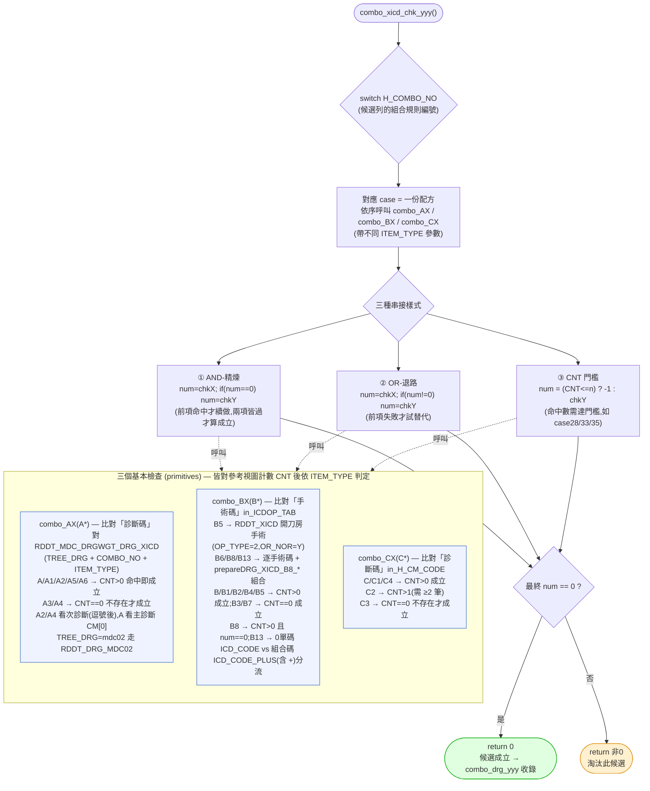

# `combo_xicd_chk_yyy` 決策流程

交叉 ICD 規則複核(判定某候選 DRG 的「組合條件 `COMBO_NO`」是否被本筆病歷滿足),對應 `_decompiled_rddt_lib\rddi_lib\rddi0001.cs` 第 2042–4244 行(全引擎最大宗,約 1,800 行)。
由 [`combo_drg_yyy`](combo_drg_yyy_flow.md) 對每個候選列呼叫;回 `0` = 該候選成立(收進候選 `array[]`),非 `0` = 淘汰。

結構上是一個 **以 `H_COMBO_NO` 為鍵的巨型 `switch`(~75 種組合規則)**,每個 case 是一份「配方」,把三個基本檢查 `combo_AX` / `combo_BX` / `combo_CX` 用串接邏輯組起來。

## 重點

### 這是規則「配方表」,不是線性流程
`H_COMBO_NO` 是候選 DRG 列上的欄位(來自 `RDDT_DRG_XICD`),代表「要成為這個 DRG,需滿足哪種診斷/手術組合」。`switch` 的每個 case 把基本檢查依該組合規則串起來。例如:

| COMBO_NO | 配方(摘錄) | 樣式 |
|----------|-------------|------|
| 1 | `combo_AX("A")` | 單一 |
| 16 | `AX("A")` 過 → `AX("A2")` | ① AND-精煉 |
| 17 | `AX("A")` 過 → `BX("B")` | ① 診斷+手術 |
| 20 | `BX("B")` 敗 → `BX("B1")` 過 → `BX("B7")` | ② OR-退路 |
| 28 | `BX("B")`;`CNT≤1 ? 淘汰 : BX("B3")` | ③ CNT 門檻 |
| 5 | `BX("B")`;特定 DRG(0370x)再走 MDC02 的 `AX("A2")` 並改碼 | 特例改碼 |

> 完整 75+ 種對應請直接讀原始碼 `combo_xicd_chk_yyy()` 的 `switch`(第 2045 行起);上表僅示意三種骨架樣式。

### 三個基本檢查的共同模式
皆是:組 `RowFilter`(限定 `TREE_DRG` + `COMBO_NO` + `ITEM_TYPE` + 碼集合)→ 套在參考視圖上算命中數 `CNT` → 依 ITEM_TYPE 決定「**存在**(`CNT>0`)」或「**不存在**(`CNT==0`)」或「**達門檻**(如 C2 需 `CNT>1`)」才回 `0`。

- **`combo_AX` / `combo_CX`** 看**診斷碼**(`in_H_CM_CODE` / `CM[0]`);差別在 C2 要求 ≥2 筆、A2/A4 看次診斷。
- **`combo_BX`** 看**手術碼**(`in_ICDOP_TAB`),且區分單碼(`ICD_CODE`)與含 `+` 的組合碼(`ICD_CODE_PLUS`);B5/B6/B8/B13 另查 `RDDT_XICD` 的開刀房屬性與 `prepareDRG_XICD_B8_*` 組合展開。

### ITEM_TYPE 的「肯定 / 否定」語意(關鍵)
同一檢查的字尾決定是「**要有**」還是「**要沒有**」:
- **肯定型**(命中才成立):`A A1 A2 A5 A6`、`B B1 B2 B4 B5`、`C C1 C4`
- **否定型**(不存在才成立):`A3 A4`、`B3 B7`、`C3`
- **特殊計數**:`B6`(num==CNT 全數命中)、`B8`(CNT>0 但 num==0)、`B13`(0<num<CNT 部分命中)、`C2`(CNT>1)

### 輸出
回 `0` → `combo_drg_yyy` 將該 `TREE_DRG` 收進候選;非 `0` → 淘汰。最終候選集再由 [`tree_yyy`](tree_yyy_flow.md) 決選。
