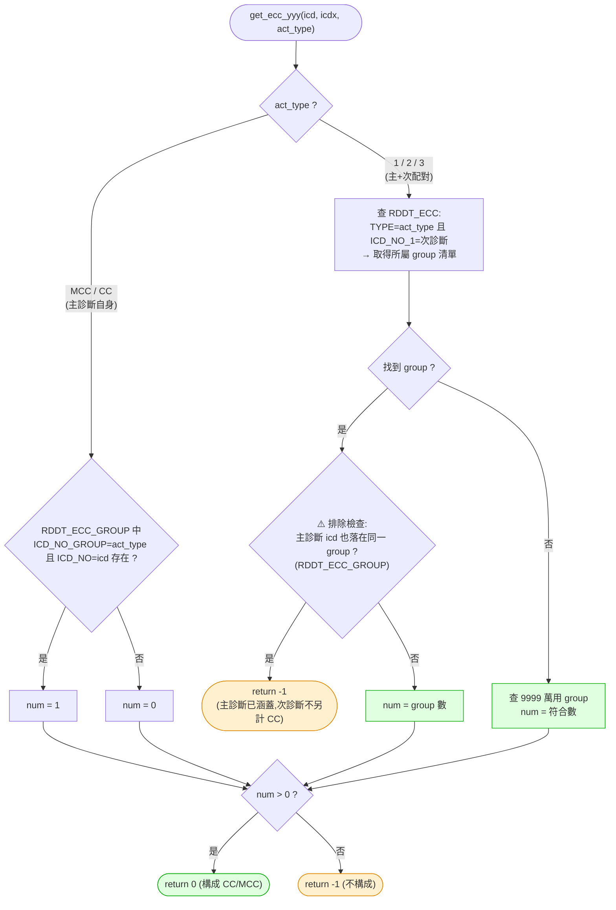

# `ecc_chk_yyy` 決策流程

併發症/合併症(CC / MCC)判定,計算 `CC_MARK` 與位元圖 `CC_CODE`,對應 `_decompiled_rddt_lib\rddi_lib\rddi0001.cs` 第 1501–1608 行。
由 `rddi1000_main` 在 `mdc_chk_yyy` 之前呼叫(見 [`rddi1000_main_flow.md`](rddi1000_main_flow.md) 的 `ECC` 節點)。結果 `H_CC_MARK_1`(Y/N)會進入 [`combo_drg_yyy`](combo_drg_yyy_flow.md) 的 CC 篩選條件,影響最終落在「有/無併發症」的 DRG。

核心是**三層優先序掃描次診斷**:MCC(重大併發症)→ T(本國特殊層)→ CC(一般併發症),命中較高層即定案並 `return`;基底為 `N`(無)。

```mermaid
flowchart TD
    Start(["ecc_chk_yyy()"]) --> Init["H_CC_MARK = N / H_CC_MARK_1 = N<br/>(預設:無併發症)"]

    Init --> T1["第1層 MCC(重大併發症)<br/>掃描 CM[0..19]"]
    T1 --> T1chk{"主診斷 CM[0] 屬 MCC群<br/>get_ecc(CM[0],'',MCC)=0<br/>或 次診斷 CM[i] 對 CM[0] 構成 MCC<br/>get_ecc(CM[0],CM[i],'2')=0 ?"}
    T1chk -- "命中" --> T1set["H_CC_MARK = M<br/>CC_CODE[i] = 1"]
    T1chk -- "未命中" --> T1next
    T1set --> T1next{"還有下一個 CM[i] ?"}
    T1next -- 是 --> T1chk
    T1next -- 否 --> T1ret{"本層有命中 (CC_MARK_1=Y) ?"}
    T1ret -- 是 --> RetM(["return 0<br/>CC_MARK = M (Major CC)"])

    T1ret -- 否 --> T2["第2層 T<br/>清空 CC_CODE<br/>掃描次診斷 CM[1..19]"]
    T2 --> T2chk{"get_ecc(CM[0],CM[i],'3') = 0 ?"}
    T2chk -- "命中" --> T2set["H_CC_MARK = T<br/>CC_CODE[i] = 1"]
    T2chk -- "未命中" --> T2next
    T2set --> T2next{"還有下一個 CM[i] ?"}
    T2next -- 是 --> T2chk
    T2next -- 否 --> T2ret{"本層有命中 ?"}
    T2ret -- 是 --> RetT(["return 0<br/>CC_MARK = T"])

    T2ret -- 否 --> T3["第3層 CC(一般併發症)<br/>清空 CC_CODE<br/>掃描 CM[0..19]"]
    T3 --> T3chk{"主診斷 CM[0] 屬 CC群<br/>get_ecc(CM[0],'',CC)=0<br/>或 次診斷 get_ecc(CM[0],CM[i],'1')=0 ?"}
    T3chk -- "命中" --> T3set["H_CC_MARK = Y<br/>CC_CODE[i] = 1"]
    T3chk -- "未命中" --> T3next
    T3set --> T3next{"還有下一個 CM[i] ?"}
    T3next -- 是 --> T3chk
    T3next -- 否 --> RetC(["return 0<br/>CC_MARK = Y (有CC) 或維持 N (無)"])

    classDef m fill:#ffe0e0,stroke:#c00;
    classDef t fill:#ffeccc,stroke:#d80;
    classDef y fill:#e0ffe0,stroke:#0a0;
    class RetM m;
    class RetT t;
    class RetC y;
```

## `get_ecc_yyy` — 查表 + 排除規則

三層掃描共用的查表函式 `get_ecc_yyy(主診斷, 次診斷, act_type)`,回 `0` = 構成 CC/MCC,`-1` = 不構成。對應第 1566–1608 行。

## 重點

### 三層優先序與輸出
| 層 | `act_type` | 命中 `CC_MARK` | 意義 |
|----|-----------|---------------|------|
| 1 | 主診斷 `MCC` / 次診斷 `2` | `M` | Major CC,重大併發症(最高權重) |
| 2 | 次診斷 `3` | `T` | 本國特殊併發症層 |
| 3 | 主診斷 `CC` / 次診斷 `1` | `Y` | 一般 CC |
| — | 皆無 | `N` | 無併發症 |

較高層命中即 `return` 並定案;進入下一層前會**清空 `CC_CODE`**,確保位元圖只反映最終定案層的貢獻位置。`H_CC_MARK_1`(Y/N)是給 `combo_drg_yyy` 用的「有無 CC」旗標;`H_CC_MARK`(M/T/Y/N)是分級。

### `CC_CODE` 位元圖
長度 20 的字串(對應 20 個診斷欄位),命中的診斷位置標 `1`,記錄「哪幾個次診斷貢獻了併發症」,寫回 `DRG_TEMP.CC_CODE` 供稽核。

### ⚠️ 排除規則(`get_ecc_yyy` 的關鍵)
配對型(`1`/`2`/`3`)查到次診斷所屬 group 後,會再檢查**主診斷是否也落在同一 group**;若是則回 `-1`——即「主診斷臨床上已涵蓋此次診斷,不可重複計為併發症」。這是 DRG 併發症計算的標準防重複規則。另有 `9999` 萬用 group 作為不分主診斷的通用 CC。

### 參考表
`RDDT_ECC`(配對規則:TYPE × ICD_NO_1 × group)與 `RDDT_ECC_GROUP`(ICD 碼 ↔ group / MCC / CC 歸屬),皆由 `rddi1000_reload_db` 經 TableAdapter 載入 `icd10.sdf`。
