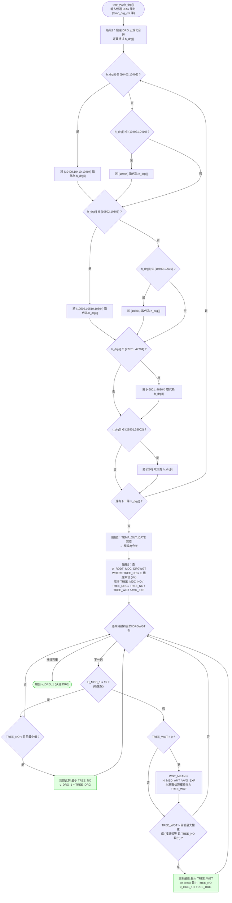

# `tree_yyy` 決策流程

DRG 候選決選步驟,對應 `_decompiled_rddt_lib\rddi_lib\rddi0001.cs` 第 1921–2040 行。
由 `rddi1000_main` 在分群尾段呼叫(見 [`rddi1000_main_flow.md`](rddi1000_main_flow.md) 的 `tree_yyy` 節點),輸入候選 DRG 陣列 `H_TEMP_DRG[]`,輸出最終 `v_DRG_1`。

## 重點

### 階段1：候選 DRG 正規化合併
把同群中「較細分 / 較高階」的 DRG 覆蓋掉「概括 / 較低階」碼,確保後續決選不會選到被取代的版本。固定合併規則(hard-coded):

| 觸發碼 | 取代目標 | 對應分群 |
|--------|----------|----------|
| `10402` / `10403` | `10409` `10410` `10404` | MDC 01 神經 |
| `10409` / `10410` | `10404` | MDC 01 神經 |
| `10502` / `10503` | `10509` `10510` `10504` | MDC 01 |
| `10509` / `10510` | `10504` | MDC 01 |
| `47701`–`47704` | `46801`–`46804` | MDC 08 肌肉骨骼 |
| `28901` / `28902` | `290` | MDC 05 循環 |

### 階段3–4:依權重決選
- 候選集合(正規化後的 `H_TEMP_DRG[]`)比對參考表 `RDDT_MDC_DRGWGT`(由 `rddi1000_reload_db` 載入)。
- **MDC 15(新生兒)**:不看權重,選 **`TREE_NO` 最小**(決策樹順位最前)的 DRG。
- **其他 MDC**:選 **`TREE_WGT` 最大**;若該列權重為 0,則以 `醫療費用 / AVG_EXP`(點數 ÷ 平均費用)推算權重代入;權重相同時以 **`TREE_NO` 最小** tie-break。

### 輸出
`v_DRG_1` = 決選出的 DRG,回到 `rddi1000_main` 續做 `v_MDC_1` 對應與心臟特例細分。
